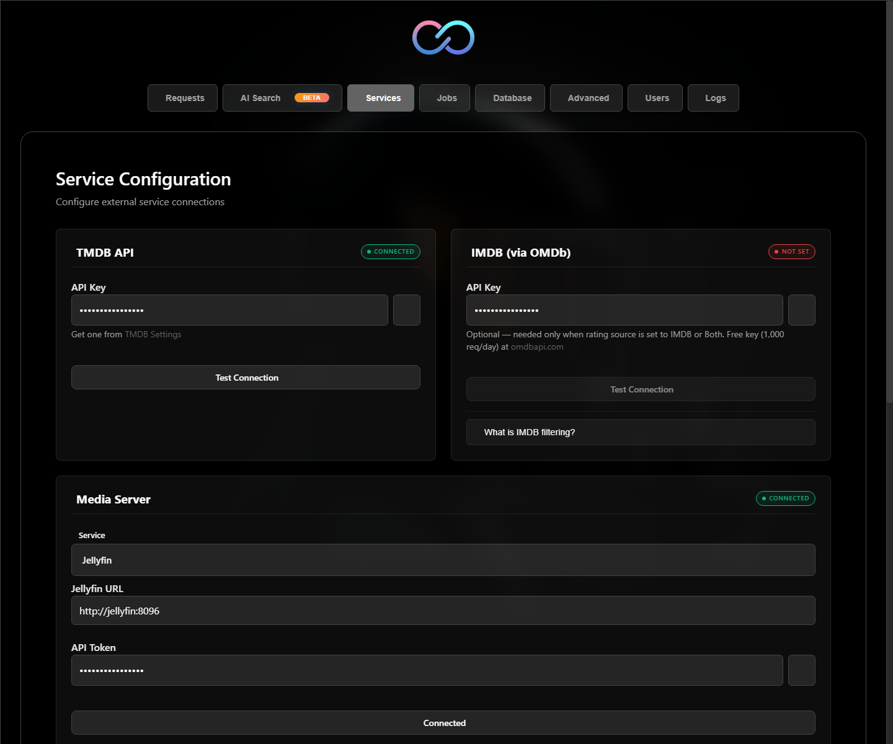
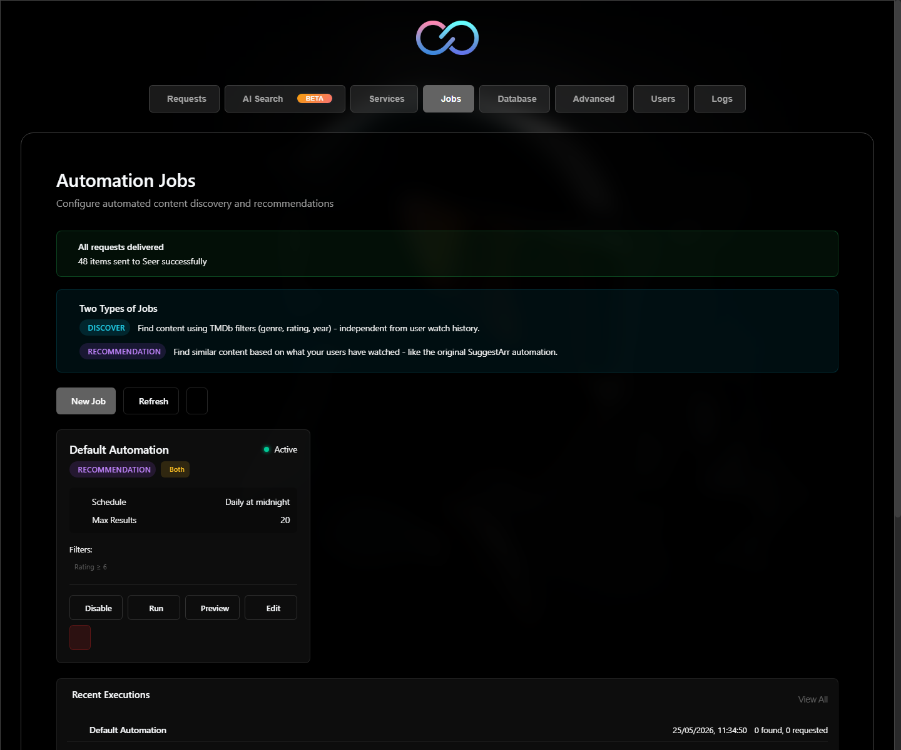
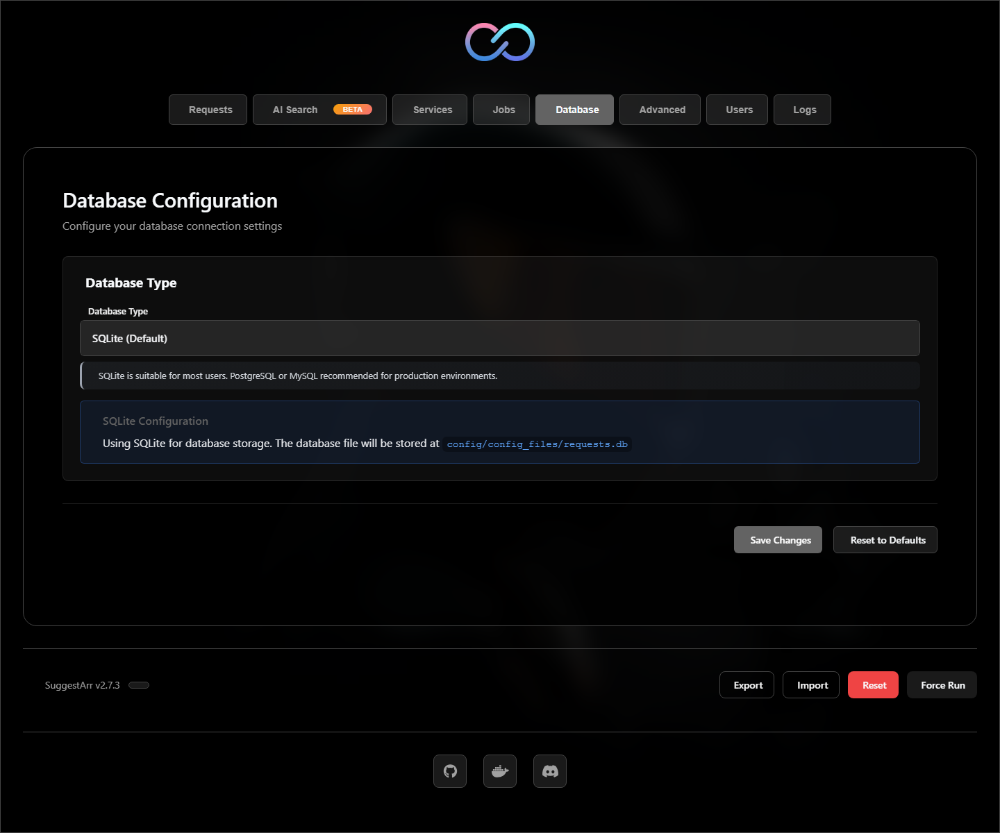
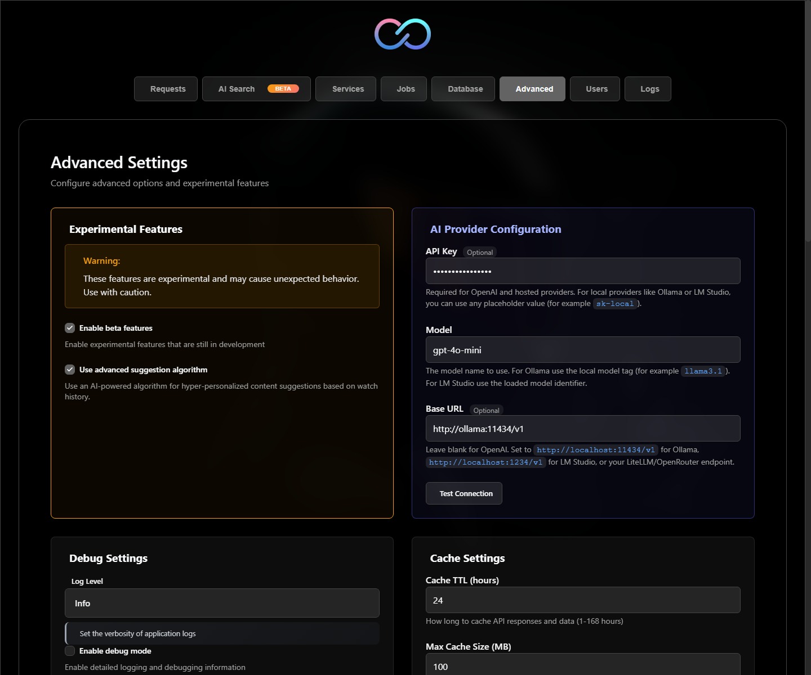

# SuggestArr Installation Guide

SuggestArr is a self-hosted web app that reads watch activity from Plex, Jellyfin, or Emby, finds recommendations through TMDb, and sends requests to Seer. The recommended installation method is Docker Compose because it keeps the Python backend, built Vue frontend, dependencies, scheduler, and persistent data in one predictable container.

## Requirements

Before installing, prepare:

- Docker and Docker Compose, or Python 3.13 and Node.js 22 for a source install.
- A TMDb API key from <https://www.themoviedb.org/settings/api>.
- One media server: Plex, Jellyfin, or Emby.
- A running Seer instance, such as Jellyseerr or Overseerr-compatible Seer.
- Network access from SuggestArr to TMDb, your media server, and Seer.
- Optional: OMDb API key for IMDb-based filters.
- Optional: OpenAI-compatible LLM provider for AI recommendations and AI Search.

## Recommended Install: Docker Compose

Create a folder for SuggestArr:

```bash
mkdir suggestarr
cd suggestarr
mkdir config_files
```

Create `docker-compose.yml`:

```yaml
services:
  suggestarr:
    image: ciuse99/suggestarr:latest
    container_name: suggestarr
    restart: unless-stopped
    ports:
      - "5000:5000"
    volumes:
      - ./config_files:/app/config/config_files
    environment:
      - SUGGESTARR_PORT=5000
      - LOG_LEVEL=INFO
      - TZ=Europe/Rome
```

Start SuggestArr:

```bash
docker compose up -d
```

Open:

```text
http://localhost:5000
```

On another machine, replace `localhost` with the host IP:

```text
http://192.168.1.10:5000
```

### Persistent Files

Keep `config_files` backed up. It contains:

- `config.yaml`: app settings and integration values.
- `requests.db`: SQLite database when using default SQLite mode.
- `secret.key`: JWT signing key. Losing it signs users out.
- `app.log`: rotating application log.

## First-Run Setup

When opening SuggestArr for the first time:

1. Create the first admin account.
2. Follow the setup wizard.
3. Add your TMDb API key.
4. Select Plex, Jellyfin, or Emby.
5. Enter media server URL and token.
6. Enter Seer URL and API key.
7. Select users and libraries.
8. Save configuration.
9. Create or adjust jobs from the Jobs page.

Use internal network URLs when running everything in Docker. Example:

```text
http://jellyfin:8096
http://jellyseerr:5055
```

If media server or Seer runs directly on the Docker host, use host IP instead of `localhost`, because `localhost` inside the container means the SuggestArr container itself.

Example:

```text
http://192.168.1.10:8096
http://192.168.1.10:5055
```

## Configuration Screenshots

The screenshots below show the main configuration areas. Values shown in the images are examples or masked placeholders.

### Services

Use this page to configure TMDb, optional OMDb, your media server, and Seer.



### Jobs

Use this page to create, preview, run, enable, or disable automated recommendation and discovery jobs.



### Database

SQLite is the recommended default. PostgreSQL, MySQL, and MariaDB are available for larger or more advanced deployments.



### Advanced

Use this page for beta features, AI provider setup, logging, caching, API timeouts, reverse-proxy subpath, registration, authentication, and cleanup settings.



## Best Configuration

### General

Recommended defaults:

- `LOG_LEVEL=INFO` for normal use.
- Keep authentication enabled.
- Keep SQLite for small and normal home installs.
- Use PostgreSQL only if you expect many users, many jobs, or want central database backups.
- Keep `EXCLUDE_DOWNLOADED=true`.
- Keep `EXCLUDE_REQUESTED=true`.
- Start with daily or every-12-hours jobs. Increase frequency only after requests look good.
- Use dry-run before enabling aggressive automated jobs.

### Content Filters

Good starting values:

- `MAX_SIMILAR_MOVIE`: `5`
- `MAX_SIMILAR_TV`: `2`
- `SEARCH_SIZE`: `20`
- `MAX_CONTENT_CHECKS`: `10`
- `FILTER_TMDB_THRESHOLD`: `6.5` or higher
- `FILTER_TMDB_MIN_VOTES`: `100` or higher
- `FILTER_INCLUDE_NO_RATING`: disabled if you want safer quality control
- `REQUEST_FIRST_SEASON_ONLY`: enabled if you want TV requests to stay controlled

For streaming availability filters:

- Set `FILTER_REGION_PROVIDER` to your country code, such as `US`, `IT`, or `GB`.
- Select streaming services you already have.
- Keep `FILTER_INCLUDE_TVOD=false` unless you also want rent/buy availability excluded.

### Jobs

Best practice:

- Create one focused movie job and one focused TV job instead of one broad job.
- Use filters per job: genre, language, rating, runtime, provider exclusions.
- Run a dry run first.
- Check results in Seer before enabling full automation.
- Use lower result counts for frequent jobs.

Example schedule choices:

```text
daily
every_12h
0 3 * * *
```

Use standard cron only if presets are not enough.

### AI Recommendations and AI Search

AI features are optional beta features. They work with OpenAI-compatible APIs.

Enable:

1. Go to Settings > Advanced.
2. Enable beta features.
3. Configure AI provider.
4. Enable advanced suggestion algorithm if you want automated AI recommendations.

OpenAI example:

```text
API Key: sk-proj-...
Base URL: leave empty
Model: gpt-4o-mini
```

Ollama example with Docker Compose:

```yaml
services:
  suggestarr:
    image: ciuse99/suggestarr:latest
    container_name: suggestarr
    restart: unless-stopped
    ports:
      - "5000:5000"
    volumes:
      - ./config_files:/app/config/config_files
    environment:
      - SUGGESTARR_PORT=5000
      - LOG_LEVEL=INFO
      - TZ=Europe/Rome

  ollama:
    image: ollama/ollama
    container_name: ollama
    restart: unless-stopped
    ports:
      - "11434:11434"
    volumes:
      - ollama_data:/root/.ollama

volumes:
  ollama_data:
```

Pull a model:

```bash
docker exec -it ollama ollama pull mistral
```

Set in SuggestArr:

```text
Base URL: http://ollama:11434/v1
Model: mistral
API Key: leave empty
```

## External Database

SQLite is default and best for most home installs. Use PostgreSQL or MySQL/MariaDB when you want stronger multi-process behavior, centralized backups, or larger deployments.

Set database values in Settings > Database, or in `config.yaml`.

PostgreSQL example:

```yaml
DB_TYPE: postgres
DB_HOST: postgres
DB_PORT: 5432
DB_USER: suggestarr
DB_PASSWORD: change-me
DB_NAME: suggestarr
```

MySQL/MariaDB example:

```yaml
DB_TYPE: mysql
DB_HOST: mariadb
DB_PORT: 3306
DB_USER: suggestarr
DB_PASSWORD: change-me
DB_NAME: suggestarr
```

If using Docker Compose, put database and SuggestArr on the same Compose network and use the database service name as host.

## Reverse Proxy

SuggestArr can run behind a reverse proxy. Recommended:

- Keep SuggestArr listening internally on port `5000`.
- Terminate HTTPS at the proxy.
- Forward `X-Forwarded-For`, `X-Forwarded-Proto`, and `Host`.
- Set `SUGGESTARR_ALLOWED_ORIGINS` if exposing the frontend from a different origin.
- Set `SUBPATH` only when hosting under a path such as `/suggestarr`.

Example environment:

```yaml
environment:
  - SUGGESTARR_PORT=5000
  - SUGGESTARR_ALLOWED_ORIGINS=https://suggestarr.example.com
```

Subpath example:

```yaml
environment:
  - SUBPATH=suggestarr
```

Then proxy:

```text
https://example.com/suggestarr
```

## Authentication

Authentication is enabled by default and should stay enabled.

Important options:

- `ALLOW_REGISTRATION=false`: default. Only admins create users.
- `AUTH_MODE=enabled`: normal login required.
- `AUTH_MODE=local_bypass`: trusted local networks can bypass login.
- `SUGGESTARR_AUTH_DISABLED=true`: disables auth. Use only for isolated testing.
- `AUTH_TRUSTED_CIDRS`: trusted CIDR list for local bypass.

Do not expose SuggestArr publicly with authentication disabled or local bypass enabled unless a separate trusted authentication layer protects it.

## Unraid

Use the Community Applications template or create a container manually:

- Repository: `ciuse99/suggestarr:latest`
- Web UI port: `5000`
- Container path: `/app/config/config_files`
- Host path: `/mnt/user/appdata/suggestarr`
- Recommended network: host or bridge, depending on your media stack.

Open:

```text
http://<unraid-ip>:5000
```

If changing the Web UI port, keep `SUGGESTARR_PORT` and the mapped port aligned.

## Source Install

Source install is useful for development. Docker is better for normal deployment.

### Windows PowerShell

From repository root:

```powershell
python -m venv .venv
.\.venv\Scripts\Activate.ps1
python -m pip install --upgrade pip
python -m pip install -r api_service\requirements.txt

cd client
npm install
npm run build
cd ..

New-Item -ItemType Directory -Force static
Copy-Item -Path client\dist\* -Destination static -Recurse -Force

$env:SUGGESTARR_PORT = "5000"
python -m api_service.app
```

Open:

```text
http://localhost:5000
```

### Linux or macOS

From repository root:

```bash
python3 -m venv .venv
. .venv/bin/activate
python -m pip install --upgrade pip
python -m pip install -r api_service/requirements.txt

cd client
npm install
npm run build
cd ..

mkdir -p static
cp -R client/dist/* static/

export SUGGESTARR_PORT=5000
python -m api_service.app
```

Open:

```text
http://localhost:5000
```

## Updating

Docker Compose:

```bash
docker compose pull
docker compose up -d
```

Then check logs:

```bash
docker logs -f suggestarr
```

Source install:

```bash
git pull
python -m pip install -r api_service/requirements.txt
cd client
npm install
npm run build
cd ..
cp -R client/dist/* static/
python -m api_service.app
```

On Windows, use the PowerShell copy command from the source install section.

## Backup and Restore

SuggestArr has two backup methods:

- UI backup with Export/Import JSON. Best for moving configuration to a new instance.
- Filesystem backup of `config_files`. Best for full disaster recovery, especially with SQLite.

### UI Export and Import

In the footer of the web interface, admins can use:

- `Export`: downloads a full configuration snapshot as a JSON file.
- `Import`: restores a configuration snapshot from a previously exported JSON file.

Use this when you want to start a new SuggestArr instance and restore the same configuration without manually entering every value again.

Recommended flow:

1. Open the old SuggestArr instance.
2. Click `Export` in the footer.
3. Save the downloaded JSON file somewhere safe.
4. Start the new SuggestArr instance.
5. Complete initial admin setup if required.
6. Click `Import` in the footer.
7. Select the exported JSON file.
8. Review services, database, jobs, and advanced settings.
9. Save or restart the container if needed.

The exported JSON can include sensitive values such as API keys and tokens. Store it like a password file.

### Filesystem Backup

Back up the full persistent config folder:

```text
config_files/
```

For Docker Compose, stop the container before copying for the cleanest SQLite backup:

```bash
docker compose down
cp -R config_files config_files.backup
docker compose up -d
```

Restore by replacing `config_files` with your backup and starting SuggestArr again.

If using PostgreSQL or MySQL, also back up the external database with its native dump tool.

## Troubleshooting

### Web UI does not open

Check container:

```bash
docker ps
docker logs suggestarr
```

Confirm port mapping:

```yaml
ports:
  - "5000:5000"
```

### Seer or media server cannot connect

Do not use `localhost` for services outside the SuggestArr container. Use:

- Docker service name when in same Compose stack.
- Host LAN IP when service runs on host.
- Real hostname when service runs elsewhere.

### Login loop after restart

Make sure `config_files/secret.key` persists. If the key changes, active sessions become invalid and users must log in again.

### Configuration resets after update

Your volume is probably wrong. The host folder must map to:

```text
/app/config/config_files
```

### AI provider fails

Check:

- Base URL includes `/v1` for OpenAI-compatible local providers.
- Model exists and is pulled if using Ollama.
- Container can reach provider URL.
- API key is valid when provider requires one.

### Need more logs

Temporarily set:

```yaml
environment:
  - LOG_LEVEL=DEBUG
```

Restart, reproduce issue, then return to `INFO`.
